# Penguin features

The full tour. The short version is the [README](../README.md).

All screenshots come from Penguin's built-in demo mode: fictional people, `.example` addresses, rendered by the real UI. See [DEMO.md](DEMO.md) to take your own.

## Search

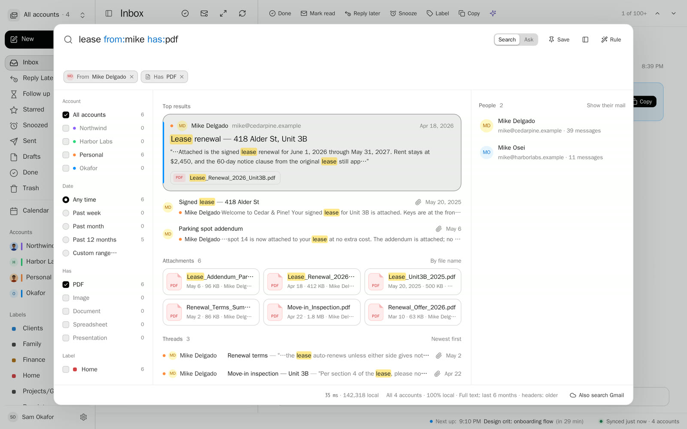

Press `/` (or ⌘F) and type. Results update on every keystroke from the local index (SQLite FTS5), across all your accounts at once, with facets for account, date, attachment type and label, the matching attachments by file name, and the people behind them.

- **Gmail's operators, and then some.** `from:` `to:` `cc:` `subject:` `label:` `in:` `is:unread` `is:starred` `has:attachment` `has:pdf` `filename:` `larger:` `before:` `after:` `older_than:` `newer_than:` `category:` `account:`, `"phrases"`, `-exclusions`, `OR`, `( )` and Gmail's `{ }`. Each one turns into a chip you can remove. `⌘/` in search lists every operator; the reference is [SEARCH.md](SEARCH.md).
- **Questions Gmail can't answer.** New senders (`is:new-sender`), the first mail you sent someone (`to:new`), replies you owe (`is:unanswered`) and replies you're waiting on (`is:awaiting`).
- **Plain English and plain dates.** "new senders last week" and "emails I sent on august 27" are read as those operators, and shown so you can adjust them. `date:"last spring"`, `date:aug1..aug15`, `on:18.08.2026`, "two weeks ago" and quarters all work.
- **What people actually type.** Typos (`crestlnie invoice`), word forms (`invoices`, `refunding`), British and American spellings, compounds (`wi-fi`, `oncall`), accents (`jose nunez` finds José Núñez), letters that don't decompose (`odegard` finds Ødegård), identifiers typed another way (`INV20417`, `1Z 4F8 A62…` in groups, `+1 415 555 0138`), pasted subjects with `RE: FW:` and `[External]`, labels without quotes, other products' syntax (`hasattachment:yes`, `NOT`, `AROUND`).
- **Search by meaning.** An on-device embedding model ([EmbeddingGemma](SEMANTIC.md) 300M, 4-bit, downloaded once from a pinned revision and checked byte for byte) finds mail that says the same thing in other words or another language: "plane tickets to portugal" finds the Lisbon boarding passes; "grandma's paella recipe" finds the Spanish one. It indexes in the background, newest mail first, and backs off on battery or when the Mac is warm.
- **Honest coverage.** Search says what it covered ("100% local, full text for the last 6 months, headers older") and "Also search Gmail" is one key away (⌘⇧↵) for mail that isn't downloaded yet.

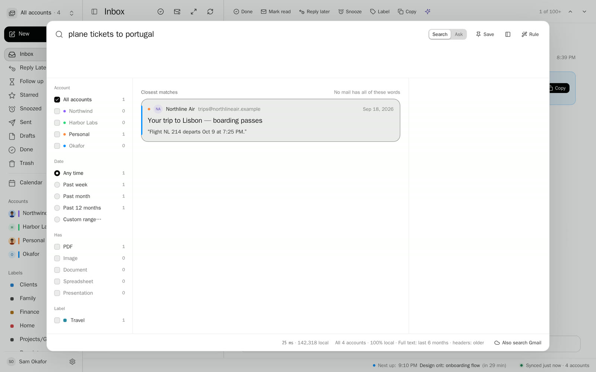

**Measured, not guessed.** `crates/penguin-eval` builds a synthetic 19,229-message mailbox and scores search on 570 judged queries: 200 core queries in nine categories and 370 edge cases drawn from the query languages of Gmail, Outlook, Apple Mail, Fastmail, Proton, notmuch, mu and Thunderbird, research on email search logs, and forum threads where a search failed ([SEARCH-CASES.md](SEARCH-CASES.md)). nDCG@10, the standard first-screen ranking metric, from [SEARCH-EVAL.md](SEARCH-EVAL.md):

| | Keyword search | Keyword + meaning (EmbeddingGemma) |
|---|---:|---:|
| All 570 queries | 0.772 | **0.951** |
| The 370 edge cases | 0.881 | **0.980** |
| Identifiers, attachments, formats (exact lookups) | 1.000 | 0.997–1.000 |
| Paraphrases (the mail uses other words) | 0.015 | **0.826** |
| Misspellings | 0.765 | **0.910** |
| Other languages (Spanish queries and mail) | 0.346 | **0.761** |

The edge-case work took keyword search from 0.594 to 0.772 over all 570 queries, with 111 queries better and none worse (paired randomization test, p < 0.001). What is still out of reach, and why, is listed at the end of [SEARCH-CASES.md](SEARCH-CASES.md#what-remains-and-why): CJK words inside a longer run, a lone emoji, derivations like "renewing" for "renewal".

## Ask your inbox

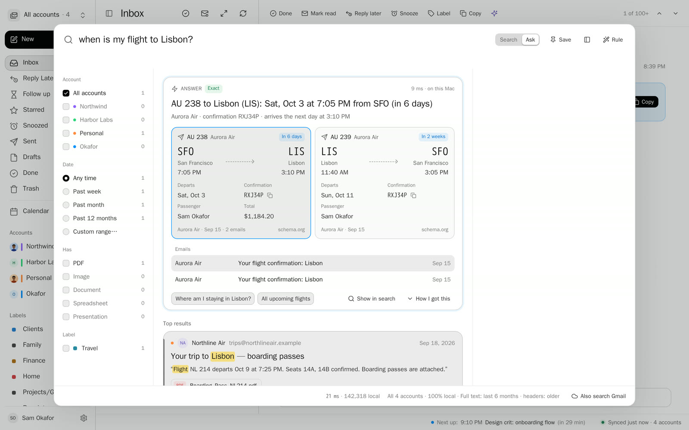

Type a question into search and Penguin answers it from your mail. Ask doesn't generate text: a fixed grammar (English and Spanish) reads the question, exact queries over the index and over facts extracted when mail was indexed compute the answer, and every claim cites the email it came from. When it isn't sure it says so and shows its sources; when a question needs every matching email (a count, a sum) it reads every one of them, never a sample. The full design is [ASK.md](ASK.md).

- **Travel:** "when is my flight to Lisbon?", "what's my confirmation code", "where am I staying in Porto?" Flight and stay cards with the route, local times, the other legs of the booking.
- **Money:** "how much did I spend at Ledgerly this year?" The total per currency, the math, what was left out and why (an order counted once even when you got a confirmation and a shipping notice), and the full list of receipts.
- **Parcels, orders, bills, reservations:** "where's my package?" (tracking numbers are checked against each carrier's check digit), "what bills are due?", "when is my dinner reservation?"
- **People:** "when did I last email Priya?", "what's Dana's phone number?" (from her own signature), "what did Priya say about pricing?" (her sentences, quoted), "did Priya reply about the contract?", "who emails me the most?", "what am I waiting on?"
- **Anything else:** the best sentences from your mail, quoted with sender and date, or "No sentence in your mail clearly answers that" and the closest emails.

Facts come from schema.org markup (JSON-LD and microdata) first, then from text patterns in English and Spanish. On the eval corpus, the extractors found 1,108 of 1,110 tagged orders, bills, parcels, flights and stays, with one spurious fact across 5,321 conversations that had none. When the search-by-meaning index is ready, Ask also uses it to find and rank the sentences it quotes.

<!-- ASK-V3 -->
**Questions built from parts.** Ask reads a question by its pieces instead of matching fixed phrasings: *what* it's about (fly, flew, trip, vuelo → flights; spend, paid, cost → money; orders, parcels, bills, bookings, messages), *what to compute* (how many, how much, total, average, most, first / last / next, list, "did I ever", group by month / store / person / place, compare "July or August"), *when* (any date phrase search understands), and *who or where*. The answer is computed exactly from every matching item, and the card shows how it read you as chips ("Understood as: Flights · Aug 1 – Aug 31, 2026 · How many") that you can change to ask again. When the grammar can't read a question and Apple Intelligence is on, Apple's on-device model fills the same query form; Penguin checks that reading against its own date parsing and your mailbox before using it, and never lets the model write the answer. English and Spanish.

On a set of real questions people ask their mail (David Pogue's Siri tests, Gmail and Copilot help, Shortwave, Superhuman, Hacker News, LongMemEval, LoCoMo, EnronQA; sources in [ASK-QUESTIONS.md](ASK-QUESTIONS.md)), Ask answers **80.6%** of 62 held-out questions correctly, up from 17.7%; count, total, list, comparison and "did I ever" questions went from near zero to 67–100%. Details and limits: [ASK.md](ASK.md).

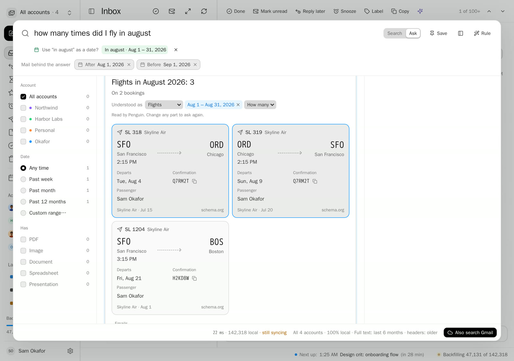
<!-- /ASK-V3 -->

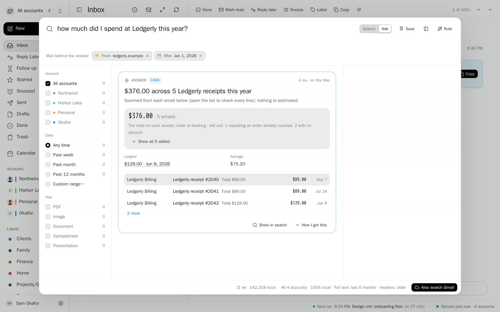

## On-device AI

Penguin's generative features run on **Apple's on-device foundation model** through the Foundation Models framework: macOS 26 or later, an Apple Intelligence Mac (M1 or later) with Apple Intelligence turned on. There's no API key and no server, and nothing runs until you ask. On other Macs the actions are hidden and Settings → AI says why.

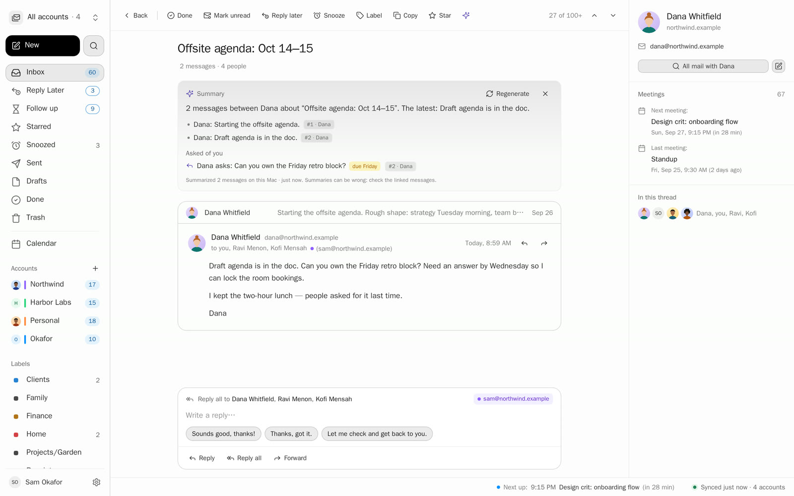

- **Thread summaries** (⇧S, or ⌘K → "Summarize conversation"): a gist, the key points and anything asked of you with its deadline. Every point links to the message it came from. Long threads are summarized in parts that fit the model's context window. A summary you already made is stored locally and shows the moment the thread opens; it's dimmed with "Update" when new mail arrives. [SUMMARIES.md](SUMMARIES.md)
- **Write with AI** (⌘⇧J in the composer): draft a reply from a one-line instruction ("yes to the warm gray, and Monday the 28th works"), or rework what you wrote: Shorter, Friendlier, More formal, Fix spelling & grammar, or your own instruction. It works on the selection if there is one. The result streams in as a suggestion you accept (↵) or discard (Esc).
- **Suggested replies** (Settings → AI, off by default): up to three short replies to the latest message, beside your own instant replies.

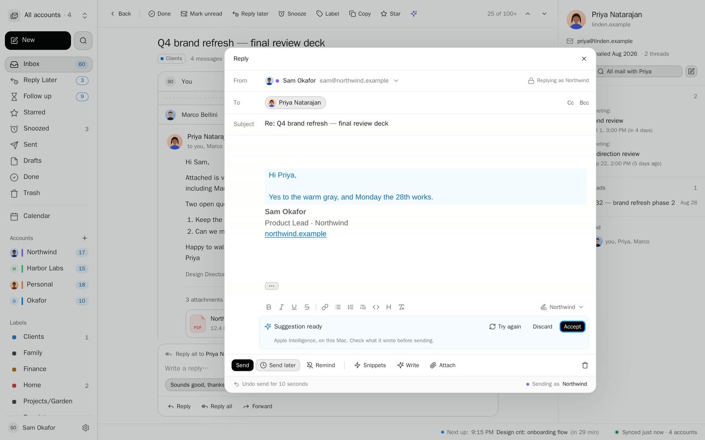

The screenshots show the demo mode's stand-in for the model, which rearranges the thread's own text so every state of the UI can be shown on any machine. Search by meaning and Ask don't use a generative model at all.

## Triage: Split Inbox, Floe and Get to zero

<picture>
  <source media="(prefers-color-scheme: dark)" srcset="images/readme/inbox-dark.jpg">
  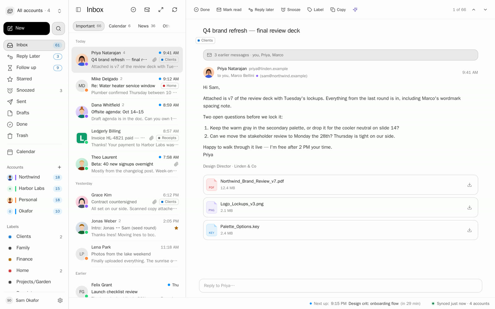
</picture>

- **Split Inbox** (Settings → Inbox, off by default). Your inbox as tabs across the top: Important, Calendar, News and Other to start. Each split is a search, so you can build your own from any query, or from presets (People you know, VIP, Team, Notifications, Attachments). A conversation lands in the first split that matches. `Tab`/`⇧Tab` or `1`–`9` move between them.
- **Floe mode** (⌘⇧F, or `\`). One calm, full-width column for working through mail: the sidebar, reading pane and status bar slide away, Enter opens a focused reading column, Esc goes back.
- **Get to zero.** Archive everything older than a day, a week, two weeks, a month, three months, or everything, keeping unread or starred mail if you like, for the whole inbox or one split. It confirms once, and Undo brings it all back.
- **Reply Later** (`y`), **snooze** (`h`), **Follow up** (sent mail with no reply after a few days), **Done** (`e`), undo (`z`), and trackpad swipes.

<p>
  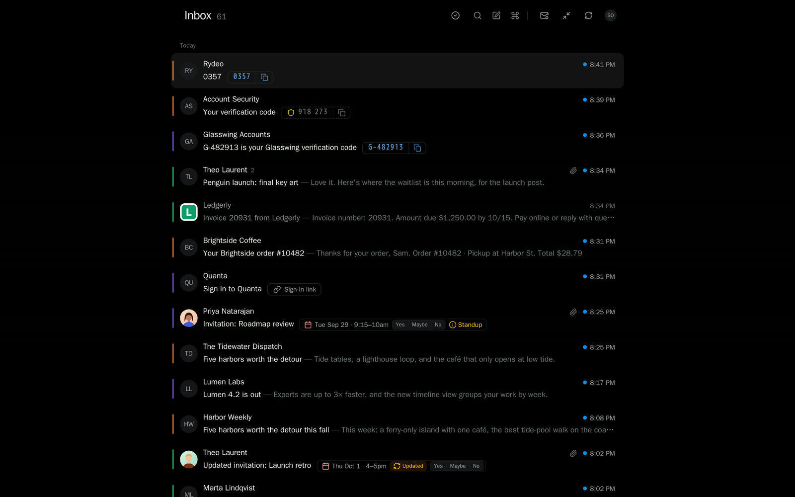
  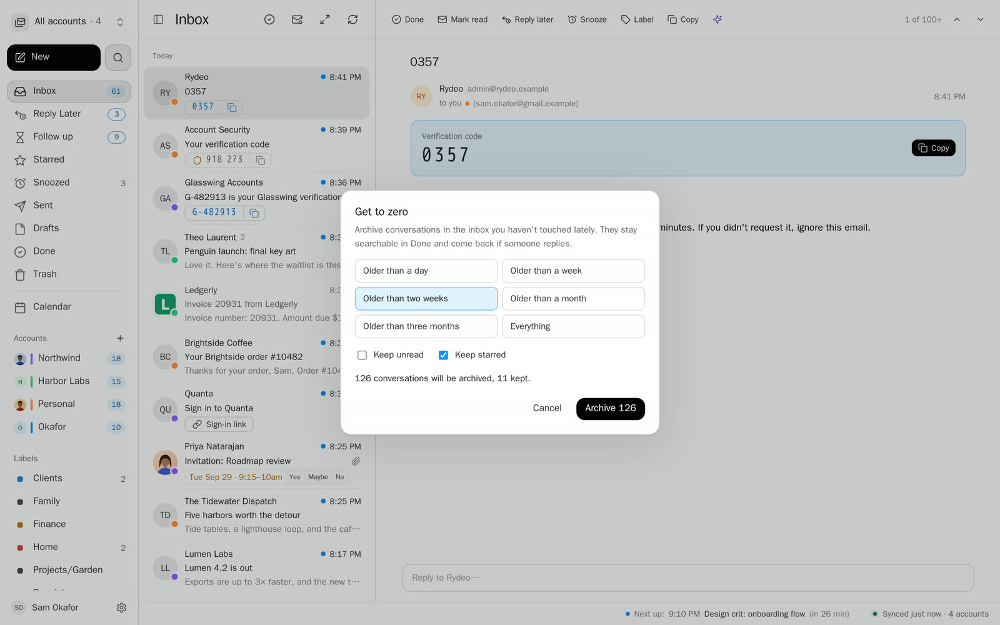
</p>

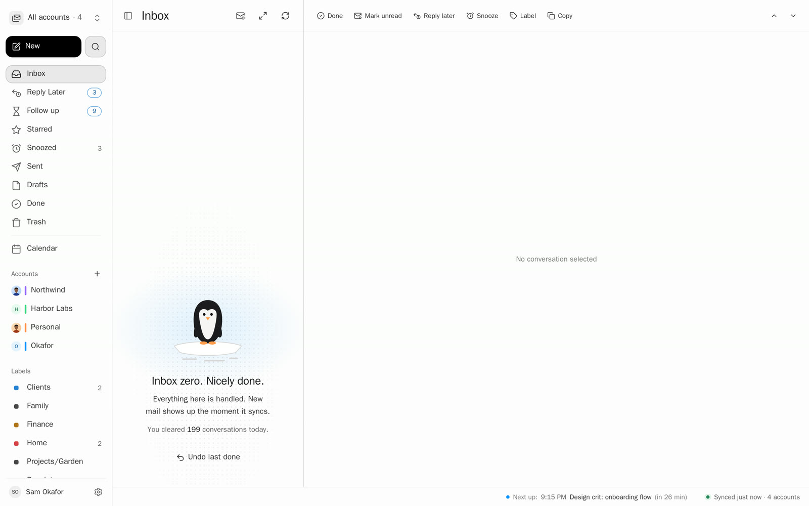

## Compose: instant replies, snippets, send later, undo send

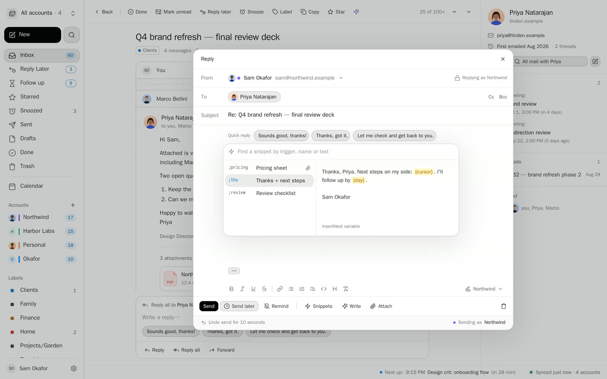

- **Instant replies.** Your own one-liners ("Sounds good, thanks!") sit above an empty reply: ⌃1–⌃9 or a click puts one in, ⌘↵ sends it. They also appear under the thread's reply box.
- **Snippets.** Type `;trigger` in the body or press ⌘; to pick one. Variables fill themselves in: `{first_name}`, `{last_name}`, `{full_name}`, `{company}` (from the recipient's domain), `{my_name}`, `{my_first_name}`, `{date}`, `{cursor}`. Any other `{placeholder}` stays for you to fill, Tab jumps between them, and Send asks first if one is left. A snippet can carry a subject, Cc/Bcc and attachments.
- **Send later** (⌘⇧↵): presets or free text ("tomorrow 9am", "oct 3 10:30"). The schedule lives on your Mac, so it sends while Penguin is running, and anything overdue goes out at the next launch.
- **Undo send:** 5, 10, 20 or 30 seconds (10 by default), or off. `z` takes it back.
- **Remind me** if nobody replies in 1, 2 or 3 days or a week.
- Rich text, per-account signatures, emoji, attachments, and a From picker that keeps replies on the account they came to.
- **Windows and tabs.** **Pop out** moves the message you're writing (new, reply or forward) into a window of its own, exactly as it is; ⌥⌘N or a right-click on New starts one there. ⇧O (or Open in new window in the right-click menu) opens a conversation in its own window, where you read, reply and triage it; archiving it closes the window, with Undo in the main window. Sending from a compose window counts down in the main window, so Undo send is always there. All of Penguin's windows join macOS tabs: Window → Merge All Windows, or "Prefer tabs" in System Settings.

## Smart views

<p>
  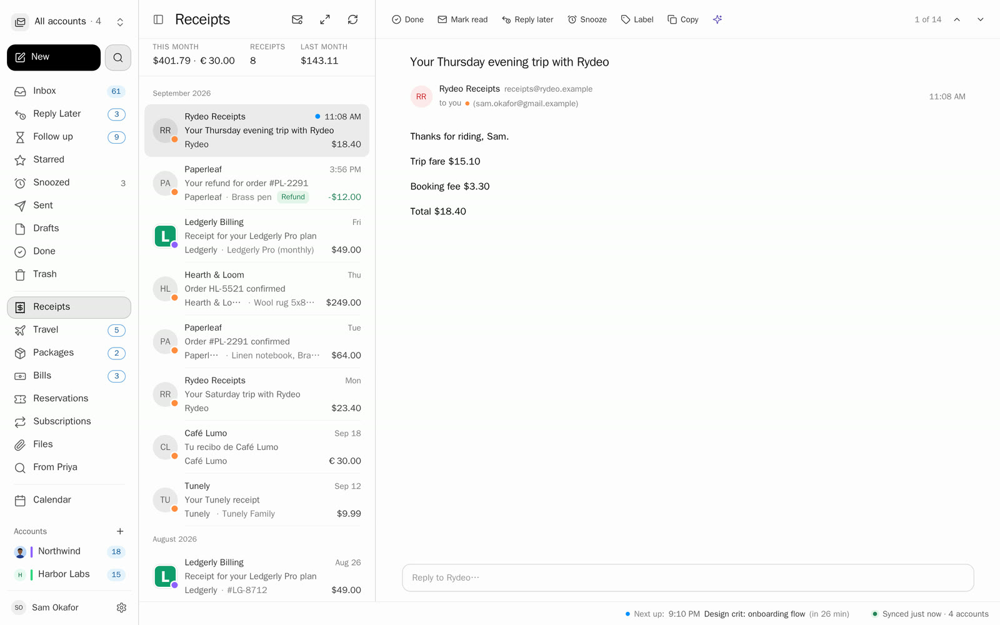
  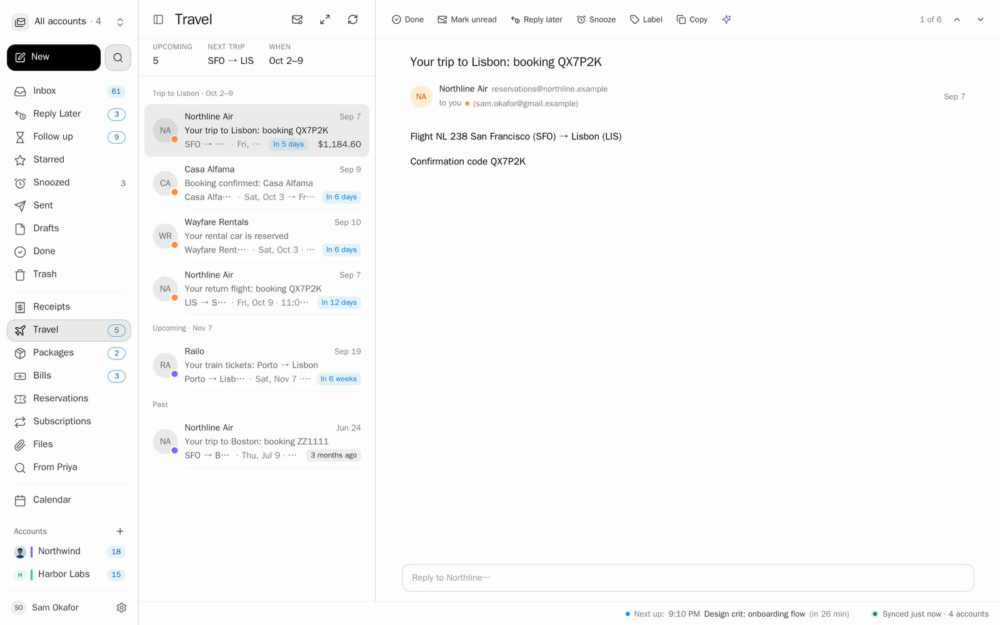
</p>

Views built from facts Penguin extracts on your Mac when mail is indexed (the same extractors as Ask), with no model and no lookups: **Receipts** (with monthly totals), **Travel** (grouped into trips), **Packages** (with delivery progress), **Bills** (due and paid), **Reservations**, **Subscriptions**, **Invites**, **Codes**, **Files**, **Newsletters** and **People you know**. Pin any saved search as a view of your own. Turn them on in Settings → Views.

## Calendar and invites

<p>
  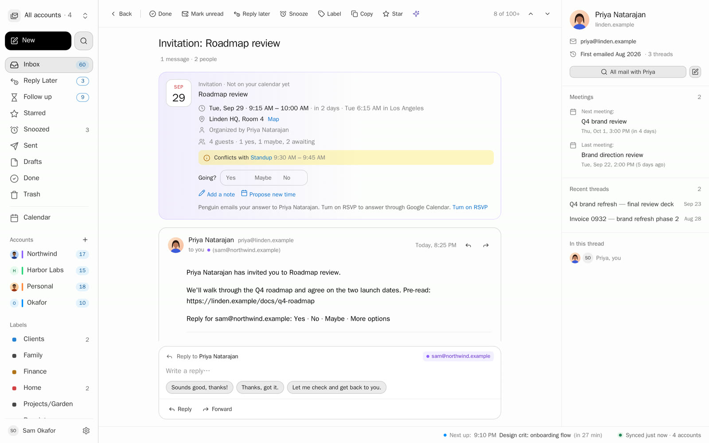
  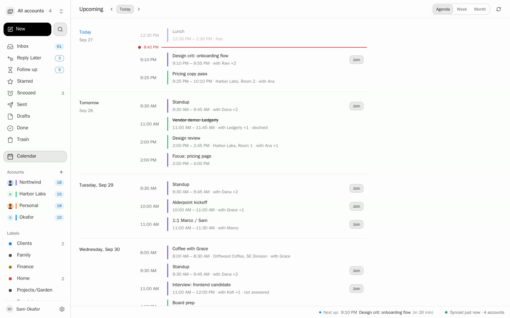
</p>

- **Invite cards** in the thread: when and where in your time zone, who's coming, conflicts with your calendar, what changed in an update, and RSVP (Yes / Maybe / No) with an optional note or a proposed new time. Answers go through Google Calendar, Microsoft Graph or a standard iMIP email, so RSVP works on every account.
- **Calendar** (`g c`): Agenda, Week and Month views of your Google calendars, a "Next up" line in the status bar, and your meetings with a person on their card. Calendar sync is Google-only for now and read-only unless you grant RSVP access.

## Image viewer

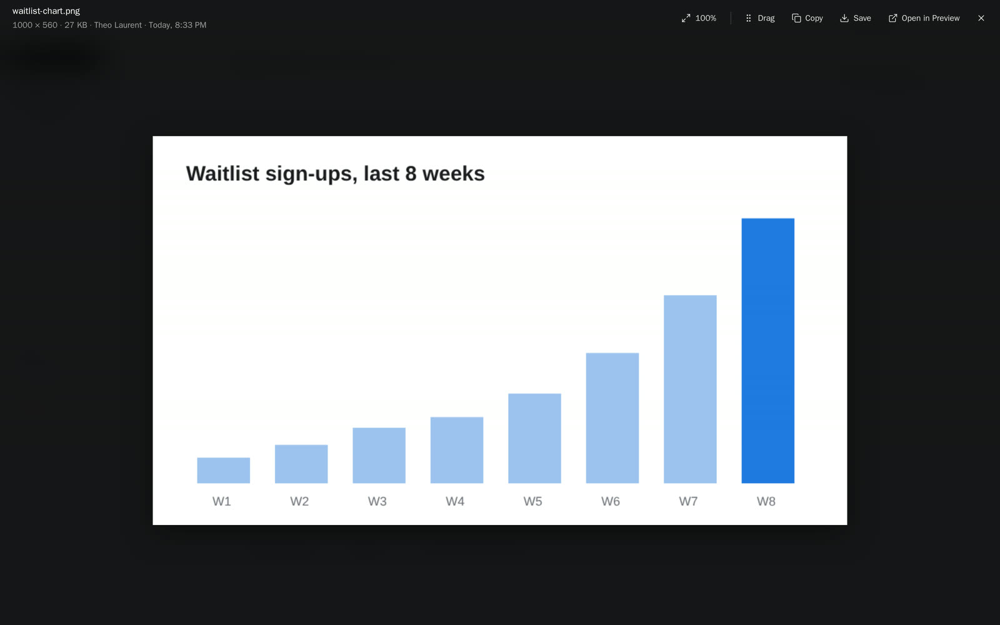

Click any picture in a message, or an image attachment, for a full-window viewer: ←/→ between pictures, zoom around the pointer (scroll or pinch, `z` for fit/100%), ⌘C, ⌘S, ⌘O for Preview. **Drag the picture out** as a real file into Finder, the Desktop or another app. The right-click menu has Copy Image, Copy Image Address, Save to Downloads, Save As…, Open in Preview and Show in Finder.

## Privacy controls

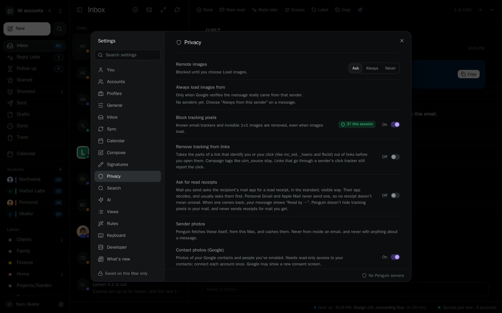

Settings → Privacy ([PRIVACY.md](PRIVACY.md)):

- **Remote images:** Ask (default), Always or Never, plus senders you always trust (only when the provider verifies the message really came from them). Penguin has no server to proxy images through, so loading them reveals your IP to their host; that's why Ask is the default.
- **Block tracking pixels** (on by default): about 90 known tracker rules plus tiny or hidden images, removed even when you load images, with a count per message and per session.
- **Remove tracking from links** (off by default): strips per-person parameters (`mc_eid`, `_hsenc`, `fbclid`, …, from Firefox's and Brave's lists) before you open a link. Campaign tags like `utm_source` stay, and unsubscribe links are left exactly as sent.
- **Read receipts, the standard way** (off by default): your mail asks for a `Disposition-Notification-To` receipt that the recipient's app shows and lets them decline. When one comes back you see "Read by …". Penguin never adds hidden tracking to your mail and never sends receipts for mail you receive.
- A line above each message says what was done to it ("2 trackers removed · 3 links cleaned"), and a click shows each tracker by company.

## Keyboard

<p>
  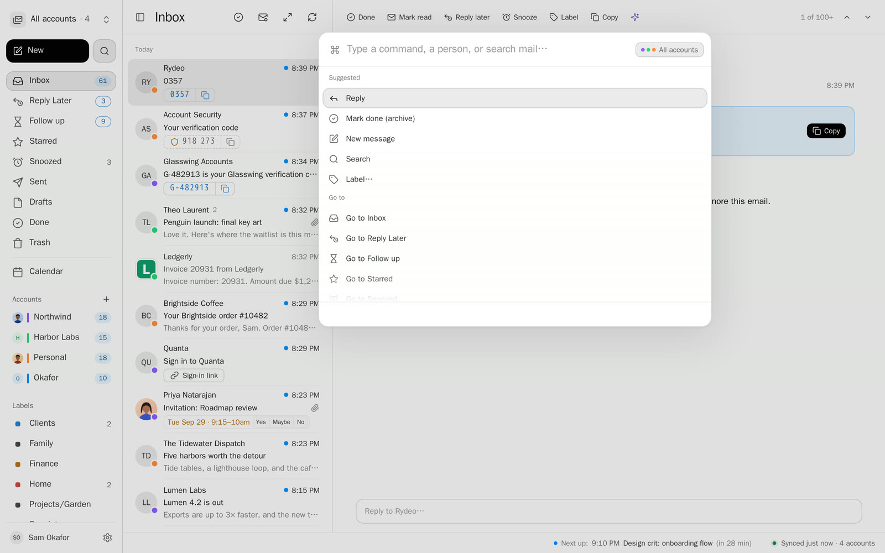
  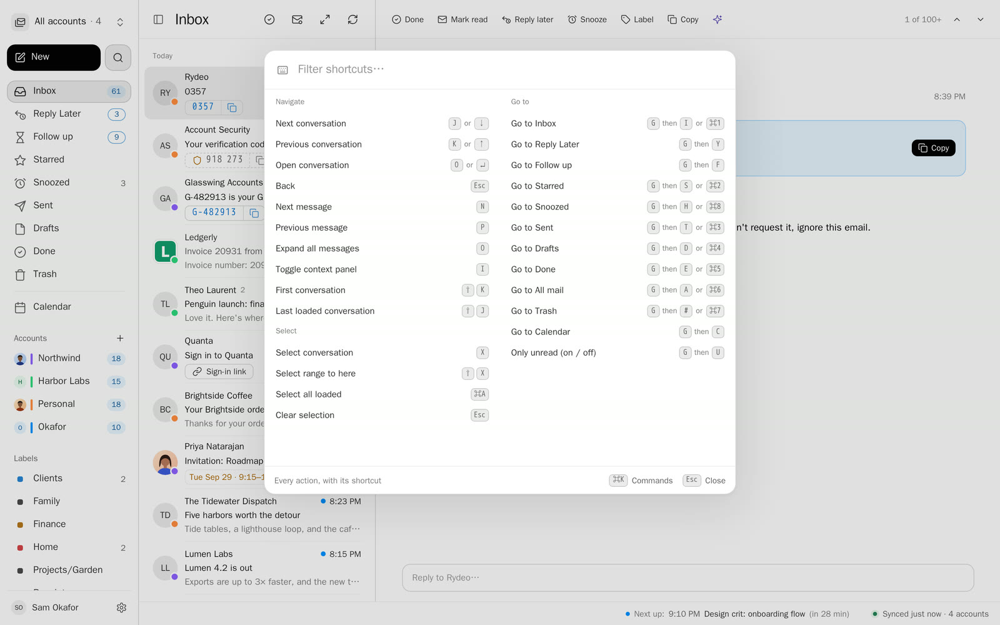
</p>

- **Gmail-style keys:** `j`/`k`, `o`, `e`, `#`, `s`, `u`, `r`, `a`, `f`, `c`, `l`, `v`, `h`, `y`, `z`, `/`, and `g` sequences (`g i`, `g s`, `g c`…).
- **⌘K** opens a command palette with every action and its key, plus views, labels, accounts, profiles, settings and "Search mail for …".
- **`?`** shows every key the app answers to, with a filter.
- **The shortcut coach** (on by default): when you do something with the mouse that has a key, a small hint by the pointer shows the key. It backs off quickly, and stops hinting a key once you use it.
- Key hints on buttons and tooltips are off by default, for a clean look, and one switch away.

## Accounts and profiles

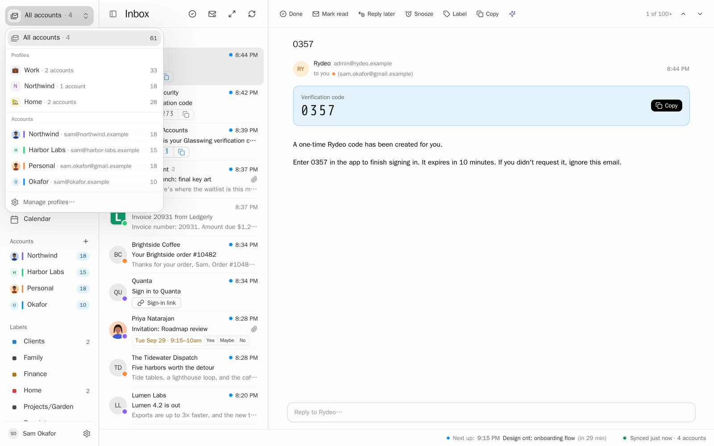

One unified inbox across every account, each with its own color, or one account at a time. **Profiles** group accounts (say, a company's four addresses) and narrow the inbox, search, labels and compose to them; ⌃1–⌃9 switch profiles and ⌃0 goes back to everything. Replies go out from the account they came to, and ⌥1–⌥9 picks the sending account.

## List styles and themes

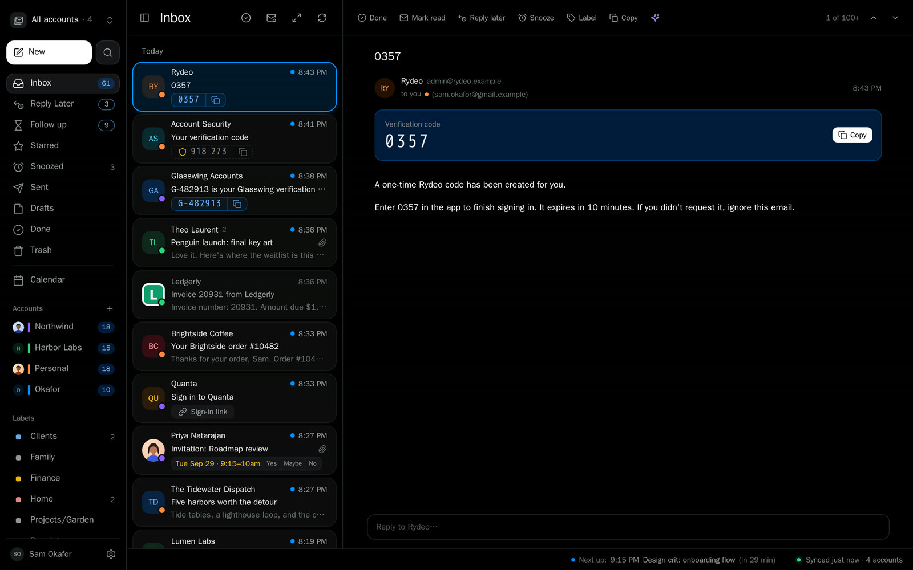

- **Five list styles:** Quiet (the default), Classic, High contrast, Cards and Mail, in compact or comfortable density.
- **Light, dark or follow macOS**, ten sidebar themes (Graphite, Midnight, Arctic, Lavender, Mint, Peach, Sky, Rose, Butter, Sage), and an option to match the accent to the theme.
- **Dark email bodies** (experimental): renders light email designs dark.

## For agents and scripts: MCP server and `penguin-cli`

`penguin-cli` searches and reads the local index from a terminal or a script, with the same query language as the app, `--json` on everything, clean stdout and typed exit codes. `penguin-cli mcp` runs a local [Model Context Protocol](https://modelcontextprotocol.io) server so AI agents like Claude Code can search and read your mail.

```sh
penguin-cli search "from:priya has:pdf after:2026-09-01" --json | jq '.data.results[].subject'
penguin-cli thread <account> <threadId> --md | claude -p "what does Priya need from me?"
claude mcp add penguin -- /Applications/Penguin.app/Contents/MacOS/penguin-cli mcp
```

The MCP server is **off until you turn it on** (Settings → Developer) and **read-only by construction**: the database is opened read-only, the Keychain is never touched, and there are no send, label, archive or delete tools. Tools: `search`, `list_threads`, `get_thread`, `thread_context`, `people`, `list_labels`, `list_accounts`, `ask`, `get_attachment_text`. Every result wraps mail content in tags with a per-call nonce and a warning not to follow instructions inside it, and every call is written to an audit log (without message content). Verification codes never appear in CLI or MCP output. [CLI.md](CLI.md)

## And more

- **Verification codes** show as chips in the list, one click to copy (⌘⇧C in the thread); sign-in links get a button.
- **Rules and automations:** conditions are searches, so anything you can find you can automate. Triggers: new mail, a label added, a schedule, or by hand. Actions: label, archive, mark read, star, trash, forward, notify, or run a shell hook or a signed webhook. New rules start in test mode. Create one from a search or from a conversation (⇧A, "Always do this…").
- **Unsubscribe** in one click (RFC 8058 one-click where the sender supports it), always asking first.
- **Notifications** (off by default): per account, optionally only from people you've written to; sender and subject, never the body.
- **Person cards and a context panel:** who someone is, your recent threads and meetings with them, shared files.
- **Demo mode** for screenshots and demos without your mail, a log viewer and a diagnostics page, and in-app updates for signed release builds.

## How it compares

A factual summary as of September 2026, from each product's public pages. Other clients change often; corrections are welcome.

| | Penguin | Superhuman | Gmail on the web | Apple Mail | Spark | Mimestream |
|---|---|---|---|---|---|---|
| Source code | Public (PolyForm Shield) | Closed | Closed | Closed | Closed | Closed |
| Price | Free | Subscription | Free (Workspace is paid) | Included with macOS | Free tier and subscription | Subscription |
| Platforms | macOS (Apple silicon) | Mac, Windows, web, iOS, Android | Browser | macOS, iOS, iPadOS | Mac, Windows, iOS, Android | macOS |
| Accounts | Gmail, Microsoft 365 / Outlook.com, IMAP | Gmail, Microsoft 365 / Outlook | Gmail | Most providers | Most providers | Gmail |
| Where your mail is indexed | On your Mac | The vendor's cloud and your device | Google's cloud | On your Mac | Your device, with vendor servers for sync features | On your Mac |
| Keyboard | Keyboard-first, ⌘K, `?` sheet, shortcut coach | Keyboard-first, ⌘K | Optional shortcuts | Menu shortcuts | Shortcuts available | Extensive shortcuts |

Penguin trades breadth for focus: one platform, no team features, no server that could offer push or image proxying, and you set up your own OAuth clients. In return, nothing about your mail leaves your Mac except what your provider already has.

## Roadmap and known limitations

- **Mac only, Apple silicon only** for release builds.
- **Calendar sync is Google-only** (RSVP works on every account).
- **Gmail sync polls.** Gmail's push notifications go through Google Cloud Pub/Sub, which needs a server, so Penguin checks each Gmail account for new mail every 30 seconds.
- **Send later, reminders and snooze run on your Mac**, so they fire while Penguin is running and catch up at the next launch.
- **Search by meaning takes a while to index** a large mailbox the first time. Newest mail is indexed first, and keyword search works throughout.
- **Search gaps** measured by the eval and not fixed yet: CJK words inside a longer run of characters, a lone emoji, derivations ("renewing" for "renewal") and real-word typos in keyword-only search.
- **Ask** is deterministic, so it only understands the question types its grammar knows, and it can still answer questions whose filters conflict instead of saying nothing.
- **Measurements on real Mac hardware** for idle wakeups, memory, WKWebView latency and embedding speed are still to be done ([PERFORMANCE.md](PERFORMANCE.md)).
- **Work and school Microsoft accounts** may need an admin to approve your app registration once.
